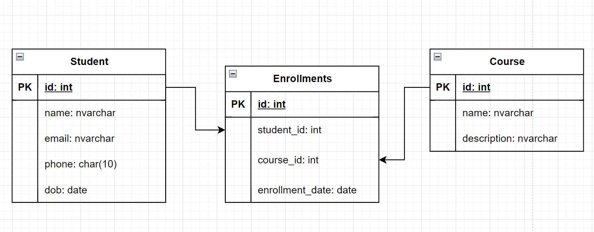

Clip demo: https://www.youtube.com/watch?v=oEEN2BrCfRY

xây dựng một ứng dụng Java sử dụng JDBC để kết nối và thao tác với một cơ sở dữ liệu MySQL. Cơ sở dữ liệu chứa các bảng sau:

students: chứa các thông tin về sinh viên, bao gồm id (số nguyên, khóa chính), name (chuỗi), email (chuỗi), phone (chuỗi), và dob (ngày tháng năm).

courses: chứa các thông tin về khóa học, bao gồm id (số nguyên, khóa chính), name (chuỗi), và description (chuỗi).

enrollments: chứa thông tin về việc đăng ký các sinh viên cho các khóa học, bao gồm id (số nguyên, khóa chính), student_id (số nguyên, khóa ngoại đến bảng students), course_id (số nguyên, khóa ngoại đến bảng courses), và enrollment_date (ngày tháng năm).

Yêu cầu của bài tập gồm có:

Kết nối tới cơ sở dữ liệu MySQL sử dụng JDBC driver.
Thực hiện các truy vấn SQL để thực hiện các tác vụ sau:
Lấy ra danh sách tất cả các sinh viên trong cơ sở dữ liệu.
Lấy ra thông tin của một sinh viên dựa trên ID.
Thêm mới một sinh viên vào cơ sở dữ liệu.
Cập nhật thông tin của một sinh viên trong cơ sở dữ liệu.
Xóa một sinh viên khỏi cơ sở dữ liệu.
Lấy ra danh sách tất cả các khóa học trong cơ sở dữ liệu.
Lấy ra thông tin của một khóa học dựa trên ID.
Thêm mới một khóa học vào cơ sở dữ liệu.
Cập nhật thông tin của một khóa học trong cơ sở dữ liệu.
Xóa một khóa học khỏi cơ sở dữ liệu.
Lấy ra danh sách tất cả các đăng ký của sinh viên.
Lấy ra danh sách tất cả các đăng ký của một sinh viên dựa trên ID.
Lấy ra danh sách tất cả các đăng ký của một khóa học dựa trên ID.
Thêm mới một đăng ký cho một sinh viên và một khóa học.
Cập nhật thông tin đăng ký của một sinh viên và một khóa học.
Xóa một đăng ký khỏi cơ sở dữ liệu.
Sử dụng các câu lệnh PreparedStatement để thay thế giá trị biến trong các truy vấn SQL và tránh các lỗ hổng bảo mật SQL injection.

Đóng kết nối tới cơ sở dữ liệu sau khi hoàn thành các thao tác.

Viết các đoạn mã xử lý ngoại lệ để bắt và xử lý các trường hợp lỗi cơ sở dữ liệu hoặc lỗi kết nối.

Viết các đoạn mã kiểm thử để kiểm tra các truy vấn SQL và các phương thức xử lý dữ liệu.

Sử dụng Maven để quản lý các thư viện phụ thuộc.

### 1. Xây dựng csdl
Sơ đồ ERD:

### 2. Xây dựng model - tương ứng với ERD làm 3 class

