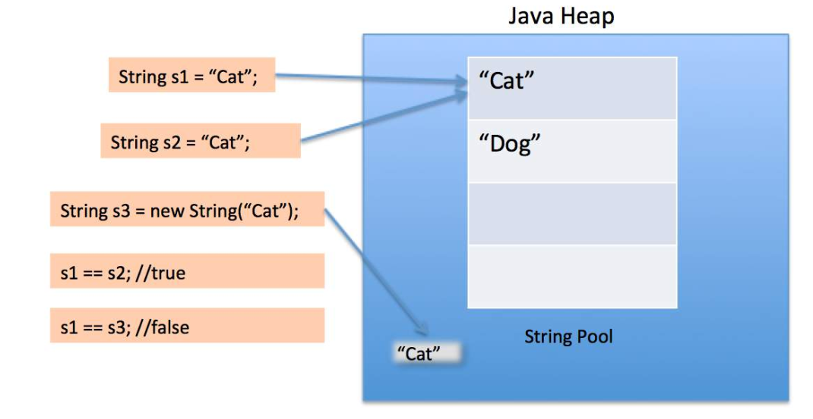

# Java From Hackerrank
### 1. Hello world
```java
public class Solution {
	public static void main(String[] args) {
		System.out.println("Hello, World.");
		System.out.println("Hello, Java.");
	}
}
```
Breakdown

```public class Solution```: khởi tạo class

```public static void main(String[] args)```: hàm luôn cần có để mọi chương trình chạy được - phần thân chính, sẽ được chạy thi chạy chương trình

+ public: khai báo phạm vi hàm - truy cập mọi nơi
+ static: hàm được gọi bởi chính class không cần thông qua instance
+ void: hàm thực thi không có giá trị trả về
+ <span style="color:red;">main </span>: tên hàm chính (cần phải có và chỉ có duy nhất 1 hàm tên main)
+ String[] args: đối số - kiểu mảng String

 ```System.out.println("Hello, World!");```: câu lệnh kết thúc bằng dấu chấm phẩy (;)
 + System: gọi class System trong package java.lang
 + dấu chấm (.) : truy cập đến các thành phần bên trong class
 + out: 1 field static trong class System - liên quan đến các lệnh xuất, in
 + println(): một method - in ra màn hình console
 + "Hello, World!": tham số truyền vào hàm println
 
 https://www.hackerrank.com/challenges/welcome-to-java
 
### 2. Input
```java
import java.util.*;
public class Solution {
    public static void main(String[] args) {
    //khởi tạo 1 instance scan của class Scanner để nhận dữ liệu nhập vào
        Scanner scan = new Scanner(System.in);
        int a = scan.nextInt();// .nextInt() nhận số nguyên, nếu nhập sai
        System.out.println(a);
    }
}
------------------
Scanner bao gồm:
nextBoolean()
nextByte()
nextDouble()
nextFloat()
nextInt()
nextLine()
nextLong()
nextShort()
next() //lấy giá trị cho đến khi gặp space, tab, enter.
+ Nếu input sai kiểu thì sẽ báo lỗi "InputMismatchException"
+ nextLine() sẽ nhận tất cả những gì nhập cho đến khi gặp Enter
+ sau nextInt() hoặc các method khác nextLine(),
nếu muốn nhập nextLine() tiếp
thì phải thêm 1 dòng nextLine()
đế lấy ký tự enter của nextInt() trước.
Ví dụ:
int i = scan.nextInt();
String s = scan.nextLine();
System.out.println(i);
// code sẽ cho nhập i và in ra luôn, ko thể nhập dc s, sửa lại
int i = scan.nextInt();
scan.nextLine();
String s = scan.nextLine();
System.out.println(i);

scan.hasNext();
kiểm tra input đã hết chưa
```
https://www.hackerrank.com/challenges/java-stdin-and-stdout-1/problem

https://www.hackerrank.com/challenges/java-stdin-stdout/problem

https://www.hackerrank.com/challenges/java-end-of-file?isFullScreen=true

### 3. Condition
```java
if(condition){
//code if true
}
else{
//code if false
}
```

https://www.hackerrank.com/challenges/java-if-else/problem?isFullScreen=true

### 4. Formatting
```java
System.out.printf("%-10s%0d%n", str, x);
//%s: str is a string
//%-10s: string + 10 spaces bên phải
//%10s: string + 10 spaces bên trái
//%d: x is a number
//%03d: thêm 0 cho đủ 5 ký tự, vd: 3 => 00003
//%n: \n =  xuống dòng
```
https://www.hackerrank.com/challenges/java-output-formatting/problem?isFullScreen=true

### 5. Loop
```java
for(int i=1; i<3; i++){
    System.out.println(i);
}
//result:
1
2
for(int i=0;i<3;i++){
	for (int j=0; j<2;j++){
         System.out.print(j + " ");
     }
     System.out.print(i+"\n");
}
//result
0 1 0
0 1 1
0 1 2
```
https://www.hackerrank.com/challenges/java-loops-i/problem

### 6. Data types
|type|range|size|default|
|--|--|--|--|
|byte|-128 to 127|8-bit|0
|int|$${-2^{31}\space to \space 2^{31}-1}$$|32-bit|0
|long|$${-2^{64}\space to \space 2^{64}-1}$$|8-bit|0L
|float||32-bit|0.0f
|double||64-bit|0.0d
|boolean|true, fasle|1-bit|false
|char|0 to 65.535|16-bit| '\u0000'
|String|||null

https://www.hackerrank.com/challenges/java-datatypes?isFullScreen=true

-----------------
***Type conversion**
```java
byte a = 1;
byte b=2;
char c=3;
short f = 5;
int d = a+b; //byte + byte => int (not byte)
int e = b+c; //byte + char =>int
int g = c+f;// char + short => int
```
--------------
***dùng uderscore (_) để tách số**
```java
int a = 123456;
int b=123_456;
//a===b => true
```
***chia cho 0**
```java
int a = 0;
float b=0;
1/a; //java.lang.ArithmeticException: / by zero
1/b;// Infinity
-1/b;//-Infinity
```
### 7. Date time & Currency
***Lớp Calendar**

```java
Calendar c = Calendar.getInstance();
c.set();//set date
c.getDisplayName(Calendar.DAY_OF_WEEK, Calendar.LONG, Locale.UK);

NumberFormat usNumber = NumberFormat.getCurrencyInstance(Locale.US);
String us = usNumber.format(payment);
```
https://www.hackerrank.com/challenges/java-date-and-time/problem

https://www.hackerrank.com/challenges/java-currency-formatter/problem

----------------
***java.sql.Date: để format ngày lưu vào database**
```java
import java.text.DateFormat;
import java.text.SimpleDateFormat;

java.util.Date a = new java.util.Date();
System.out.println(a);//Wed Apr 19 00:37:36 GMT 2023
java.sql.Date b = new java.sql.Date(a.getTime());
//a.getTime() => return miliseconds since January 1, 1970, 00:00:00 GTM
System.out.println(b);//2023-04-19
////////////////////////////
DateFormat df = new SimpleDateFormat("dd/MM/YYYY - hh:mm:ss");
//SimpleDateFormat kế thừa từ DateFormat
System.out.println("dateFormated date is : " + df.format(a));
//dateFormated date is : 19/04/2023 - 02:56:46
```
-------------
**java.time.*;**
```java
// Create a default date
LocalDate lDate = LocalDate.now();
// Creates a date from values
lDate = LocalDate.of(2017, 12, 15);
// create a date from string
lDate = LocalDate.parse("2017-12-15");
// creates a date from zone
LocalDate.now(ZoneId.systemDefault());
```
>Lớp  **ZoneId**  được sử dụng để định danh một múi giờ và cung cấp các quy tắc chuyển đổi giữa  **LocalDateTime**  và  **Instant**. Về mặt quy tắc độ lệch (offset rules),  **ZoneId**  được chia làm 2 loại:
>1.  **ZoneId**  với độ lệch múi giờ (time zone offset) cố định, chẳng hạn  **"UTC+07", "GMT-05:40", "UT-03", "+05:50"**.[ ``ZoneId.of("GMT-06:05:20")``]
>2.  **ZoneId**  với độ lệch múi giờ không cố định, chẳng hạn  **"Europe/Paris"**, độ lệch múi giờ của nó phụ thuộc vào thời điểm trên dòng thời gian hoặc phụ thuộc vào ngày trong năm. [``ZoneId.of("Europe/Paris")``]
```java
// Create a default date time
LocalDateTime lDateTime = LocalDateTime.now();
// Creates a date time from values
lDateTime = LocalDateTime.of(2017, 12, 15, 11, 30);
// create a date time from string
lDateTime = LocalDateTime.parse("2017-12-05T11:30:30");
// create a date time from zone
LocalDateTime.now(ZoneId.systemDefault());
```
--------------------
```java
//Date <=> LocalDate
Date date = Date.from(Instant.now());
ZoneId defaultZoneId = ZoneId.systemDefault();
// Date to LocalDate
LocalDate localDate = date.toInstant().atZone(defaultZoneId).toLocalDate();
// LocalDate to Date
Date.from(localDate.atStartOfDay(defaultZoneId).toInstant());
```
-------------------
```java
//Date <=> LocalDateTime
Date date = Date.from(Instant.now());
ZoneId defaultZoneId = ZoneId.systemDefault();
// Date to LocalDateTime
LocalDateTime localDateTime = date.toInstant().atZone(defaultZoneId).toLocalDateTime();
// LocalDateTime to Date
Date out = Date.from(localDateTime.atZone(defaultZoneId).toInstant());
```
=> Conclusion: 
+ Lấy thứ ngày tháng: Calendar
+ Lấy ngày, giờ: Date, DateTime
+ Lấy ngày add vào db: sql.Date
+ Lấy ngày giờ theo vùng: LocalDate, LocalDateTime, LocalTime

Tham khảo thêm: https://gpcoder.com/4062-date-time-trong-java-8/

### 8. String
```java
String s1 = "Hello World";//s1 = Hello World
String s2 = "Hello"+" "+"World";//s2 = Hello World
String s3 = "\""; // s3 = "
String s4 = "D:\\Document";//s4 = D:\Document
```
----------------
***Các method của string**

+ .length() -> int
+ .substring(start,end) -> String
+ .toLowerCase(), .toUpperCase() -> String
+ .equal() -> boolean, .compareTo()-> int
+ .charAt(index) -> char
+ .contains(substring) ->boolean
+ .indexOf(string)->int (-1 if not found)
----------------
***So sánh string**

```java
String s1 = "Cat";
String s2 = "Cat";
String  s3 = new String("Cat");
System.out.println(s1 == s2);//true
System.out.println(s2 == s3);//false
System.out.println(s1.equals(s3));//true
```



https://www.hackerrank.com/challenges/java-strings-introduction/problem

https://www.hackerrank.com/challenges/java-substring

https://www.hackerrank.com/challenges/java-loops-i/problem

https://www.hackerrank.com/challenges/java-string-reverse/problem

https://www.hackerrank.com/challenges/java-anagrams/problem
----------------
+ .split(string or regex) -> String[]
```java
//Java regex pattern
Pattern pattern = Pattern.compile("w",Pattern.CASE_INSENSITIVE);
//nếu lỗi: "PatternSyntaxException"
Matcher matcher = pattern.matcher("www.google.com");
boolean matchFound = matcher.find(); //true
//some pattern
[^abc]: ký tự không phải a,b hay c
\d: tìm ký tự là số
```
for more pattern: https://docs.oracle.com/javase/8/docs/api/java/util/regex/Pattern.htmlp

https://www.hackerrank.com/challenges/java-string-tokens/problem

https://www.hackerrank.com/challenges/pattern-syntax-checker/problem

```
Hint regex for IP:
[01]?[0-9]?[0-9]: 000 ->199, hoặc 0 -> 199
2[0-4][0-9]: 100 -> 249
25[0-5]: 250 -> 255
```

https://www.hackerrank.com/challenges/valid-username-checker/problem

https://www.hackerrank.com/challenges/java-regex/problem

```
regex nhóm từng group
pattern = "<(.+)>([^<>]+)</(\\1)>"
string = "<h1>Nayeem loves counseling</h1>"
=> group 1: h1
=> group 2: Nayeem loves counseling
=> group 3: h1
--------------
regex cho từ lặp lại: "\\b(\\w+)(\\W\\1)+\\b"
```
----------------
***StringBuffer: có từ java 1, String có thể mutable - chỉnh sửa, và thread-safe (không thể nhiều thread cùng truy cập)**
```java
String a = "hello";
a.concat("world");
System.out.println(a);//hello

StringBuffer b = new StringBuffer("hello");
b.append("world");
System.out.println(b);//helloworld
```
----------------
***StringBuilder: 1 dạng nâng cấp của StringBuffer (có từ java 5), thread-unsafe**
```java
StringBuilder b = new StringBuilder ("hello");
b.append(" ").append("world");
System.out.println();//hello world
```
----------------
***Behind the scence của cộng string chính là append của StringBuilder**
```java
String a = "a";
String a = "b";
String a = "c";
String s = a+b+c;//abc
///Cách java hoạt động
StringBuilder sb = new StringBuilder("a");
String s = sb.append("b").append("c").toString();//abc
```
----------------
### 9. BigInteger, BigDecimal
```java
String n= "999999999";
String m= "8888888888";
BigInteger a = new BigInteger(n);
BigInteger b = new BigInteger(m);
a.add(b);//a+b
a.multiply(b);//a*b
String k= "8888883333888.3338"
BigDecimal c = new BigDecimal(k);
```
----------------
###  10. Array
```java
// init array
int[] numbers1 = new int[3]; // Array for 3 int values, default value is 0  
int[] numbers2 = { 1, 2, 3 }; // Array literal of 3 int values  
int[] numbers3 = new int[] { 1, 2, 3 }; // Array of 3 int values initialized  
int[][] numbers4 = { { 1, 2 }, { 3, 4, 5 } }; // Jagged array literal  
int[][] numbers5 = new int[5][]; // Jagged array, one dimension 5 long  
int[][] numbers6 = new int[5][4]; // Multidimensional array: 5x4
int[] array4 = null;
int array5[];/* equivalent to */ int[] array5;
int a, b[], c[][]; /* equivalent to */ int a; int[] b; int[][] c;
int[] a, b[];/* equivalent to */ int[] a; int[][] b;
int a, []b, c[][]; /* Compilation Error,
because [] is not part of the type at beginning of the declaration,
rather it is before 'b'. */  
// The same rules apply when declaring a method that returns an array:  
int foo()[] { ... } /* equivalent to */ int[] foo() { ... }

//Sort
Arrays.sort(array);

//print array
for(int i=0; i<array.length; i++){
	System.out.println(array[i]);
}
for (int e : array) {  //for read only
System.out.println(e);  
}
//copy array from originArray, with size = newSize
String[] newArray = Arrays.copyOf(originArray, newSize);
int[] a = { 4, 1, 3, 2 };  
int[] b = Arrays.copyOfRange(a, 0, a.length-1); // [4, 1, 3]
```
----------------
### 11. Collections: List
```java
//List init
List a = new ArrayList();
List b = new LinkedList();
List c = new Vector(); 
List d = new Stack();
List<Integer> list=new ArrayList<Integer>(){{
                        add(1);
                        add(2);
                        add(3);
                          }};
List<Integer> list=Arrays.asList(1, 2, 3);
     
List<String>[] list = new ArrayList<String>[2]; // Compilation error!
List<List<String>> list = new ArrayList<ArrayList<String>>[];//list 2D
/*các collections của java về sau nhưa List, ArrayList, Map,...
đều tùng type là Wrapper Classes (chuyển type primitive sang object).
Ví dụ: List<int> => error phải là List<Integer>
Chỉ cần chuyển các type từ in thường sang in hoa chữ cái đầu là được
*/
//List là Interface, ArrayList implement List
//list method
ArrayList<Integer> a = new ArrayList<>();//a=[]
a.add(1);//a=[1]
a.add(2);//a=[1,2]
a.add(3);//a=[1,2,3]
a.set(1,99);//a=[1,99,3]
System.out.println(a.get(1));//99
a.size();//3
a.remove(2);//[1,99]
a.add(3);//[1,99,3]
a.subList(0,1);//[1]
Collections.sort(a);//[1,3,99]
//duyệt list
//Version < Java SE 5
for (int i = 0; i < names.size(); i++) {
	System.out.println(names.get(i));
}
//Version ≥ Java SE 5
for (String name : names) {
	System.out.println(name);
}
//Version ≥ Java SE 8
names.forEach(System.out::println);
//Dùng next(), hasNext() của Iterator (mục 14)
```


https://www.hackerrank.com/challenges/java-1d-array-introduction/problem

https://www.hackerrank.com/challenges/java-list/problem

https://www.hackerrank.com/challenges/java-arraylist/problem

https://www.hackerrank.com/challenges/java-bigdecimal/problem

----------------
***Bạn có thể truy cập args trong ``public  static  void  main(String[] args)``**
- Khi chạy code bằng terminal: java <tên app> arg1 arg2
- Các giá trị arg1, arg2 sẽ được đưa vào args = ["arg1", "arg2"]

### 12. Collections: Map

```java
Map<Integer,String> mymap = new HashMap<Integer,String>();
//Map là Interface, HashMap implement Map
mymap.put(key, value);
mymap.containsKey(key);
mymap.get(key);
mymap.remove(key);
//get tất cả các key thành Set
Set<Integer> set = map.keySet();
//get tất cả các key-value thành Set
Set<Integer> set = map.entrySet();
//Iterator Map
for (Map.Entry<Integer, String> entry : names.entrySet()) {
	System.out.println(entry.getKey());
	System.out.println(entry.getValue());
}
```
----------------
### 13. Collections: Set
```java
Set<String> setA = new HashSet<String>();
setA.add("string 1");
set.contains("string 2";//false
Iterator<String> iterator = setA.iterator();
while (iterator.hasNext()) {
	System.out.println((String) iterator.next());
}
```
----------------
### 14. Collections: Iterator, \<Generic>
```java
List<String> fruits = new ArrayList<String>();
fruits.add("Apple");
fruits.add("Banana");
fruits.add("Strawberry");
//chuyển List thành 1 Iterator 
//.hasNext(): kiểm tra còn phần tử
//.next(): duyệt đến phần tử tiếp theo
//.add(value)
//.set(index, value)
Iterator<String> fruitIterator = fruits.iterator();
while(fruitIterator.hasNext()) {
	String fruit = fruitIterator.next();
	System.out.println(fruit);
	if ("Apple".equals(fruit)) {
		fruitIterator.remove();
	}
}
//chúng ta có thể implements Iterable để tạo ra Iterator riêng
```
----------

```java
//ArrayList<> phía sau ko cần điền type
//nó sẽ lấy type lúc khai báo
ArrayList<Integer> a = new ArrayList<>();//a=[]
///
public  static  <T>  void  printArray(T[]  arr){
	for(T  a:arr){
		System.out.println(a);
		}
}
/// <?> để chỉ kiểu bất kỳ có thể extend thêm vào
```
### 15. Comparator: để truyền vào làm so sánh trong sort
```java
class  UserComparator implements  Comparator<User>  {
	@Override
	public  int  compare(User u1,  User  u2)  {
		return u1.username.compareTo(u2.username);
	}
}
Collections.sort(users,UserComparator );
//Version ≥ Java SE 8
Collections.sort(users, (l, r) -> l.username.compareTo(r.username));
users.sort((l, r) -> l.username.compareTo(r.username));
```
----------------
### 16. Dequeue
```java
Deque dq = new ArrayDeque();
qd.add(value);
dq.removeFirst();
dq.removeLast();
dq.peekFirst();
dq.removeLast();
```
### 17. Exception
```java
Scanner  scan  =  new  Scanner(System.in);
try{
	int  x  =  scan.nextInt();
	int  y  =  scan.nextInt();
	System.out.println(x/y);
}
catch(Exception  e){
	System.out.println(e.toString());
}
```

https://www.hackerrank.com/challenges/java-exception-handling-try-catch

https://www.hackerrank.com/challenges/java-exception-handling/problem

### 18. File
```java
import  java.io.File;  // Import the File class
import  java.io.FileWriter;//Write to file
import  java.io.IOException;  // Import the IOException class to handle errors
import  java.util.Scanner;
public  class  App  {
	public  static  void  main(String[] args)  throws  Exception{
		System.out.println("Hello, World!");
		try {
			//////// check file tồn tại - hoặc tạo file mới
			File  myObj  =  new  File("newfile.txt");
			if (myObj.createNewFile()) {
				System.out.println("File created: "  + myObj.getName());
			} else {
				System.out.println("File already exists.");
			}
			///////// ghi vào file
			FileWriter  myWriter  =  new  FileWriter(myObj.getName(), true);
			myWriter.write("Files in Java might be tricky, but it is fun enough!\n");
			myWriter.close();
			System.out.println("Successfully wrote to the file.");
			///////////// đọc file
			Scanner  myReader  =  new  Scanner(myObj);
			while (myReader.hasNextLine()) {
				String  data  =  myReader.nextLine();
				System.out.println(data);
			}
			myReader.close();
			} catch (IOException  e) {
				System.out.println("An error occurred.");
				e.printStackTrace();
			}
		}
}
```

### 19. Thread
Cho phép các class, hàm chạy song song.

a) Cách tạo thread

- Cách 1: extends Thread

```java
//Thread1.java
public class Thread1 extends Thread{
	public void run(){
		System.out.println("thread 1 is running...");
	}
}
//App.java
public class App  {
	public static void main(String[] args) throws Exception{
		Thread1 t1  =  new Thread1();
		t1.start();
	}
}
```

- Cách 2: implements Runnable

```java
//Thread1.java
public class Thread1 implements Runnable{
	public void run()  {
		System.out.println("thread 1 is running...");
	}
}
//App.java
public class App  {
	public static void main(String[] args) throws Exception{
		Thread t1 = new Thread(new Thread1());
		t1.start();
	}
}
```

b) Thread lifecycle


c) setPriority

```java
//Thread1.java
public class Thread1 extends Thread{
	public void run()  {
		System.out.println("thread 1 is running...");
	}
	public void getHello()  {
		System.out.println("hello thread 1");
	}
}

//Thread2.java
public class Thread2 extends Thread{
	public void run(){
		System.out.println("thread 2 is running...");
	}
	public void getHello(){
		System.out.println("hello thread 2");
	}
}

//App.java
public class App{
	public static void main(String[] args) throws Exception{
		Thread1 t1 = new Thread1();
		Thread2 t2 = new Thread2();
		t2.setPriority(2);
		t1.setPriority(1);
		t1.start();
		t2.start();
		t2.getHello();
		t1.getHello();
	}
}
//Result
//hello thread 1
//hello thread 2
```


