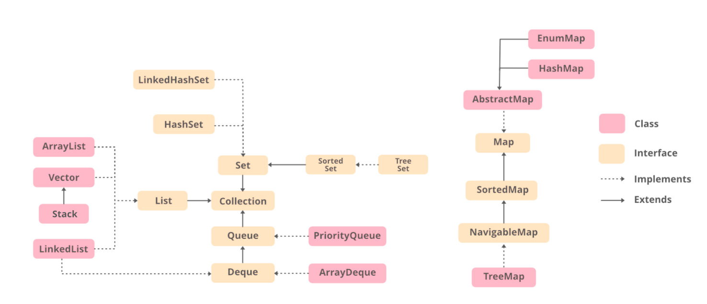
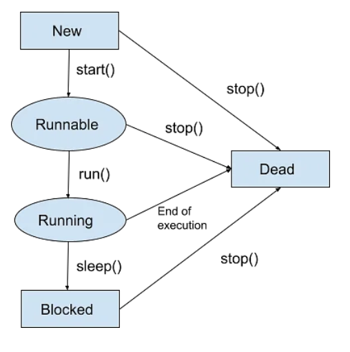

# Java From Hackerrank
### 1. Hello world
```java
public class Solution {
	public static void main(String[] args) {
		System.out.println("Hello, World.");
		System.out.println("Hello, Java.");
	}
}
```
Breakdown
```public class Solution```: khởi tạo class
```public static void main(String[] args)```: hàm luôn cần có để mọi chương trình chạy được - phần thân chính, sẽ được chạy thi chạy chương trình
+ public: khai báo phạm vi hàm - truy cập mọi nơi
+ static: hàm được gọi bởi chính class không cần thông qua instance
+ void: hàm thực thi không có giá trị trả về
+ <span style="color:red;">main </span>: tên hàm chính (cần phải có và chỉ có duy nhất 1 hàm tên main)
+ String[] args: đối số - kiểu mảng String

 ```System.out.println("Hello, World!");```: câu lệnh kết thúc bằng dấu chấm phẩy (;)
 + System: gọi class System trong package java.lang
 + dấu chấm (.) : truy cập đến các thành phần bên trong class
 + out: 1 field static trong class System - liên quan đến các lệnh xuất, in
 + println(): một method - in ra màn hình console
 + "Hello, World!": tham số truyền vào hàm println
 
 https://www.hackerrank.com/challenges/welcome-to-java
 
### 2. Input
```java
import java.util.*;
public class Solution {
    public static void main(String[] args) {
    //khởi tạo 1 instance scan của class Scanner để nhận dữ liệu nhập vào
        Scanner scan = new Scanner(System.in);
        int a = scan.nextInt();// .nextInt() nhận số nguyên, nếu nhập sai
        System.out.println(a);
    }
}
------------------
Scanner bao gồm:
nextBoolean()
nextByte()
nextDouble()
nextFloat()
nextInt()
nextLine()
nextLong()
nextShort()
+ Nếu input sai kiểu thì sẽ báo lỗi "InputMismatchException"
+ nextLine() sẽ nhận tất cả những gì nhập cho đến khi gặp Enter
+ sau nextInt() hoặc các method khác nextLine(),
nếu muốn nhập nextLine() tiếp
thì phải thêm 1 dòng nextLine()
đế lấy ký tự enter của nextInt() trước.
Ví dụ:
int i = scan.nextInt();
String s = scan.nextLine();
System.out.println(i);
// code sẽ cho nhập i và in ra luôn, ko thể nhập dc s, sửa lại
int i = scan.nextInt();
scan.nextLine();
String s = scan.nextLine();
System.out.println(i);

scan.hasNext();
kiểm tra input đã hết chưa
```
https://www.hackerrank.com/challenges/java-stdin-and-stdout-1/problem

https://www.hackerrank.com/challenges/java-stdin-stdout/problem

https://www.hackerrank.com/challenges/java-end-of-file?isFullScreen=true

### 3. Condition
```java
if(condition){
//code if true
}
else{
//code if false
}
```

https://www.hackerrank.com/challenges/java-if-else/problem?isFullScreen=true

### 4. Formatting
```java
System.out.printf("%-10s%0d%n", str, x);
//%s: str is a string
//%-10s: string + 10 spaces bên phải
//%d: x is a number
//%03d: thêm 0 cho đủ 5 ký tự, vd: 3 => 00003
//%n: \n =  xuống dòng
```
https://www.hackerrank.com/challenges/java-output-formatting/problem?isFullScreen=true

### 5. Loop
```java
for(int i=1; i<3; i++){
    System.out.println(i);
}
//result:
1
2
for(int i=0;i<3;i++){
	for (int j=0; j<2;j++){
         System.out.print(j + " ");
     }
     System.out.print(i+"\n");
}
//result
0 1 0
0 1 1
0 1 2
```
https://www.hackerrank.com/challenges/java-loops-i/problem

### 6. Data types
|type|range|size|default|
|--|--|--|--|
|byte|-128 to 127|8-bit|0
|int|$${-2^{31}\space to \space 2^{31}-1}$$|32-bit|0
|long|$${-2^{64}\space to \space 2^{64}-1}$$|8-bit|0L
|float||32-bit|0.0f
|double||64-bit|0.0d
|boolean|true, fasle|1-bit|false
|char|0 to 65.535|16-bit| '\u0000'
|String|||null

https://www.hackerrank.com/challenges/java-datatypes?isFullScreen=true

### 7. Date time & Currency
```java
Calendar c = Calendar.getInstance();
c.set();//set date
c.getDisplayName(Calendar.DAY_OF_WEEK, Calendar.LONG, Locale.UK);

NumberFormat.getCurrencyInstance(Locale.US).format(vl
```
https://www.hackerrank.com/challenges/java-date-and-time/problem

https://www.hackerrank.com/challenges/java-currency-formatter/problem

### 8. String
Các method của string
+ .length() -> int
+ .substring(start,end) -> String
+ .toLowerCase(), .toUpperCase() -> String
+ .equal() -> boolean, .compareTo()-> int
+ .charAt(index) -> char

https://www.hackerrank.com/challenges/java-strings-introduction/problem

https://www.hackerrank.com/challenges/java-substring

https://www.hackerrank.com/challenges/java-loops-i/problem

https://www.hackerrank.com/challenges/java-string-reverse/problem

https://www.hackerrank.com/challenges/java-anagrams/problem

+ .split(string or regex) -> String[]
```java
//Java regex pattern
Pattern pattern = Pattern.compile("w",Pattern.CASE_INSENSITIVE);
//nếu lỗi: "PatternSyntaxException"
Matcher matcher = pattern.matcher("www.google.com");
boolean matchFound = matcher.find(); //true
//some pattern
[^abc]: ký tự không phải a,b hay c
\d: tìm ký tự là số
```
for more pattern: https://docs.oracle.com/javase/8/docs/api/java/util/regex/Pattern.htmlp

https://www.hackerrank.com/challenges/java-string-tokens/problem

https://www.hackerrank.com/challenges/pattern-syntax-checker/problem

```
Hint regex for IP:
[01]?[0-9]?[0-9]: 000 ->199, hoặc 0 -> 199
2[0-4][0-9]: 100 -> 249
25[0-5]: 250 -> 255
```

https://www.hackerrank.com/challenges/valid-username-checker/problem

https://www.hackerrank.com/challenges/java-regex/problem

```
regex nhóm từng group
pattern = "<(.+)>([^<>]+)</(\\1)>"
string = "<h1>Nayeem loves counseling</h1>"
=> group 1: h1
=> group 2: Nayeem loves counseling
=> group 3: h1
--------------
regex cho từ lặp lại: "\\b(\\w+)(\\W\\1)+\\b"
```
### 9. BigInteger, BigDecimal
```java
String n= "999999999";
String m= "8888888888";
BigInteger a = new BigInteger(n);
BigInteger b = new BigInteger(m);
a.add(b);
a.multiply(b);
```
###  10. Array
```java
int[] a = new int[n]; //array 1D
List<List<Integer>> arr = new ArrayList<>();//list 2D
/*các collections của java về sau nhưa List, ArrayList, Map,...
đều tùng type là Wrapper Classes (chuyển type primitive sang object).
Ví dụ: List<int> => error phải là List<Integer>
Chỉ cần chuyển các type từ in thường sang in hoa chữ cái đầu là được
*/
List là Interface, ArrayList implement List
//list method

ArrayList<Integer> a = new ArrayList<>();//a=[]
a.add(1);//a=[1]
a.add(2);//a=[1,2]
a.add(3);//a=[1,2,3]
a.set(1,99);//a=[1,99,3]
System.out.println(a.get(1));//99
a.size();//3
a.remove(2);//[1,99]
a.add(3);//[1,99,3]
Collections.sort(a);//[1,3,99]
```



https://www.hackerrank.com/challenges/java-1d-array-introduction/problem

https://www.hackerrank.com/challenges/java-list/problem

https://www.hackerrank.com/challenges/java-arraylist/problem

https://www.hackerrank.com/challenges/java-bigdecimal/problem

### 11. Map
```java
Map<Integer,String> mymap = new HashMap<Integer,String>();
Map là Interface, HashMap implement Map
mymap.put(key, value);
mymap.containsKey(key);
mymap.get(key);
mymap.remove(key);
Set<Integer> set = map.keySet(); //get tất cả các key thành Set
Set<Integer> set = map.entrySet();//get tất cả các key-value thành Set
```

### 12. Set
```java
Set<String> setA = new HashSet<String>();
setA.add("string 1");
set.contains("string 2";//false
Iterator<String> iterator = setA.iterator();
while (iterator.hasNext()) {
	System.out.println((String) iterator.next());
}
```
### 13. Generic
```java
public  static  <T>  void  printArray(T[]  arr){
	for(T  a:arr){
		System.out.println(a);
		}
}
```
### 14. Comparator
```java
class  Checker  implements  Comparator<Player>  {
	@Override
	public  int  compare(Player  p1,  Player  p2)  {
		if(p2.score  ==  p1.score){
			return  p1.name.compareTo(p2.name);
		}
		return  p2.score-p1.score;
		}
	}
}
```
### 15. Dequeue
```java
Deque dq = new ArrayDeque();
qd.add(value);
dq.removeFirst();
dq.removeLast();
dq.peekFirst();
dq.removeLast();
```
### 16. Exception
```java
Scanner  scan  =  new  Scanner(System.in);
try{
	int  x  =  scan.nextInt();
	int  y  =  scan.nextInt();
	System.out.println(x/y);
}
catch(Exception  e){
	System.out.println(e.toString());
}
```

https://www.hackerrank.com/challenges/java-exception-handling-try-catch

https://www.hackerrank.com/challenges/java-exception-handling/problem

### 17. File
```java
import  java.io.File;  // Import the File class
import  java.io.FileWriter;//Write to file
import  java.io.IOException;  // Import the IOException class to handle errors
import  java.util.Scanner;
public  class  App  {
	public  static  void  main(String[] args)  throws  Exception{
		System.out.println("Hello, World!");
		try {
			//////// check file tồn tại - hoặc tạo file mới
			File  myObj  =  new  File("newfile.txt");
			if (myObj.createNewFile()) {
				System.out.println("File created: "  + myObj.getName());
			} else {
				System.out.println("File already exists.");
			}
			///////// ghi vào file
			FileWriter  myWriter  =  new  FileWriter(myObj.getName(), true);
			myWriter.write("Files in Java might be tricky, but it is fun enough!\n");
			myWriter.close();
			System.out.println("Successfully wrote to the file.");
			///////////// đọc file
			Scanner  myReader  =  new  Scanner(myObj);
			while (myReader.hasNextLine()) {
				String  data  =  myReader.nextLine();
				System.out.println(data);
			}
			myReader.close();
			} catch (IOException  e) {
				System.out.println("An error occurred.");
				e.printStackTrace();
			}
		}
}
```

### 18. Thread
Cho phép các class, hàm chạy song song.
a) Cách tạo thread
- Cách 1: extends Thread
```java
//Thread1.java
public class Thread1 extends Thread{
	public void run(){
		System.out.println("thread 1 is running...");
	}
}
//App.java
public class App  {
	public static void main(String[] args) throws Exception{
		Thread1 t1  =  new Thread1();
		t1.start();
	}
}
```
- Cách 2: implements Runnable
```java
//Thread1.java
public class Thread1 implements Runnable{
	public void run()  {
		System.out.println("thread 1 is running...");
	}
}
//App.java
public class App  {
	public static void main(String[] args) throws Exception{
		Thread t1 = new Thread(new Thread1());
		t1.start();
	}
}
```

b) Thread lifecycle



c) setPriority

```java
//Thread1.java
public class Thread1 extends Thread{
	public void run()  {
		System.out.println("thread 1 is running...");
	}
	public void getHello()  {
		System.out.println("hello thread 1");
	}
}

//Thread2.java
public class Thread2 extends Thread{
	public void run(){
		System.out.println("thread 2 is running...");
	}
	public void getHello(){
		System.out.println("hello thread 2");
	}
}

//App.java
public class App{
	public static void main(String[] args) throws Exception{
		Thread1 t1 = new Thread1();
		Thread2 t2 = new Thread2();
		t2.setPriority(2);
		t1.setPriority(1);
		t1.start();
		t2.start();
		t2.getHello();
		t1.getHello();
	}
}
//Result
//hello thread 1
//hello thread 2
```


