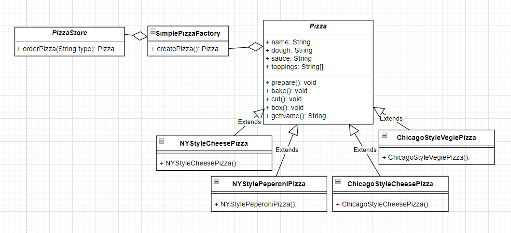

*tài liệu tham khảo từ sách **HEAD FIRST DESIGN PATTERN***

+ Mô phỏng 1 qui trình làm bánh pizza (prepare - bake - cut -box) với đoạn code
```java
public class PizzaStore {
    Pizza orderPizza() {
        Pizza pizza = new Pizza();
        pizza.prepare();
        pizza.bake();
        pizza.cut();
        pizza.box();
        return pizza;
    }
}
```
+ Nếu có nhiều loại pizza thì phải điều chỉnh code
```java
public class PizzaStore {
    Pizza orderPizza(String type) {
        Pizza pizza;
        if (type.equals("cheese")) {
            pizza = new CheesePizza();
        } else if (type.equals("greek")) {
            pizza = new GreekPizza();
        } else if (type.equals("pepperoni")) {
            pizza = new PepperoniPizza();
        }
        pizza.prepare();
        pizza.bake();
        pizza.cut();
        pizza.box();
        return pizza;
    }
}
```
+ Nếu hệ thống mở rộng thêm nhiều loại pizza nữa thì code trên phải được bổ sung thêm
```java
public class PizzaStore {
    Pizza orderPizza(String type) {
        Pizza pizza;
        if (type.equals("cheese")) {
            pizza = new CheesePizza();
        } else if (type.equals("greek")) {
            pizza = new GreekPizza();
        } else if (type.equals("pepperoni")) {
            pizza = new PepperoniPizza();
            // phần được mở rộng
        } else if (type.equals("clam")) {
            pizza = new ClamPizza();
        } else if (type.equals("veggie")) {
            pizza = new VeggiePizza();
        }
        pizza.prepare();
        pizza.bake();
        pizza.cut();
        pizza.box();
        return pizza;
    }
}
```
+ Code được chỉnh sửa như thế đã vi phạm nguyên tắt "O" trong "SOLID": open for extension - close for modification.
+ Để khắc phục vấn đề này, cần tách phần if-else ra => 1 class gọi là Factory => nơi tạo ra các class khác nhau.
```java
public class SimplePizzaFactory {
    public Pizza createPizza(String type) {
    Pizza pizza = null;
    if (type.equals("cheese")) {
        pizza = new CheesePizza();
    } else if (type.equals("pepperoni")) {
        pizza = new PepperoniPizza();
    } else if (type.equals("clam")) {
        pizza = new ClamPizza();
    } else if (type.equals("veggie")) {
        pizza = new VeggiePizza();
    }
    return pizza;
    }
}
```
+ Từ đây, phía client sẽ order pizza thông qua SimplePizzaFactory
```java
public class PizzaStore {
    SimplePizzaFactory factory;

    public PizzaStore(SimplePizzaFactory factory) {
        this.factory = factory;
    }

    public Pizza orderPizza(String type) {
        Pizza pizza;
        pizza = factory.createPizza(type);
        pizza.prepare();
        pizza.bake();
        pizza.cut();
        pizza.box();
        return pizza;
    }
    // other methods here
}
```
+ Chúng ta có UML sơ lược như sau:



+ Với mục đích mở rộng thị trường, 
tiệm pizza cho mở nhiều chi nhánh ở nhiều nơi,
tuy nhiên mỗi vùng miền lại có 1 khẩu vị và đặc trưng riêng trong chế biến
với quy trình vẫn giữ nguyên, chỉ thay đổi bên trong đề phù hợp.
+ Chúng ta chỉ cần tạo thêm các class extends Pizza tương ứng và các Factory với mỗi nơi.

```java
    NYPizzaFactory nyFactory = new NYPizzaFactory();
    PizzaStore nyStore = new PizzaStore(nyFactory);
    nyStore.order(“Veggie”);

    ChicagoPizzaFactory chicagoFactory = new ChicagoPizzaFactory();
    PizzaStore chicagoStore = new PizzaStore(chicagoFactory);
    chicagoStore.order(“Veggie”);
```
+ Lúc này chúng ta thấy rằng tất cả mọi nơi đều dùng chung PizzaStore, để code linh hoạt hơn chúng ta sẽ tạo ra những Store riêng
+ Chúng ta có UML sơ lược như sau:


