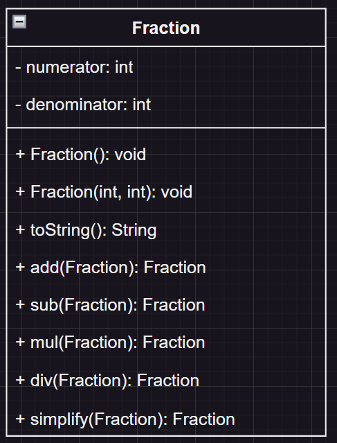

## 1. Bài tập khởi động
a) Yêu cầu
> Thiết kế class phân số với các chức năng
> - Khởi tạo phân số, kiểm tra phân số hợp lệ (mẫu khác 0)
> - In phân số
> - Cộng, trừ, nhân, chia phân số
> - Rút gọn phân số

b) Phân tích: class Fraction bao gồm
+ Tử số (numerator) - type int (private)
+ Mẫu số (denominator) - type int (private)
+ Constructor (public):
    + Fraction() - khởi tạo phân số mặc định (0)
    + Fraction(numerator,denominator) - khởi tạo phân số với tử số và mẫu số
+ getter, setter cho tử và mẫu (tính đóng gói)
+ override toString() để in phân số (tính đa hình)
+ các phương thức: cộng, trừ, nhân, chia, rút gọn

c) Vẽ UML

*Giải thích sơ đồ:
- Dấu trừ (-): private
- Dấu cộng (+): public
- ``numerator:int`` : tên property:kiểu dữ liệu
- ``sub(Fraction):Fraction``: tên hàm(kiểu tham số):kiểu trả về

## 2. OOP basic 1 - class và object 
- class: một kiểu dữ liệu - một dạng định nghĩa cấu trúc, do người dùng tự định nghĩa

|thành phần của class|tương ứng trong bài tập|chức năng|
|--|--|--|
|properties - thuộc tính|``numerator, denominator``|lưu trữ các giá trị của class|
|methods - phương thức| ``add(), sub(), mul(), div()``|các hàm cần dùng cho class|
|constructor - hàm khởi tạo|``public Fraction(){}``|khởi tạo giá trị ban đầu, hàm sẽ được gọi khi tạo 1 instance mới ``Fraction f1 = new Fraction();``|
|this|``this.numerator``|truy cập đến chính bản thân class|

- Phạm vi truy cập - Access Modifiers

|access modifier|trong class|chung package|ngoài package - trong subclass|ngoài package|
|--|--|--|--|--|
|private|yes|no|no|no|
|protected|yes|yes|yes|no|
|public|yes|yes|yes|yes|
|(default)|yes|yes|no|no|

- object - là 1 instance (thể hiện) của class

 ``Fraction f1 = new Fraction();``
   + Fraction là class
   + f1 là object 

