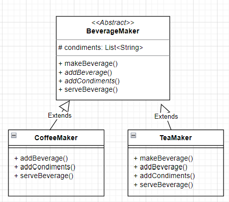

### 1. Bài tập mở đầu
a) Yêu cầu
Viết 1 chương trình pha chế đồ uống với các yêu cầu sau:
- Có 2 loại đồ uống Coffee và Tea
- Mỗi loại đồ uống có cách pha chế khác nhau,mô phỏng bằng hàm makeBeverage(), gồm 3 bước: 
  - thêm đồ uống: addBeverage()
  - thêm topping: addCondiments()
  - phục vụ: serveBeverage()

b) Phân tích
- Với 2 loại đồ uống => có 2 class tương ứng: CoffeeMaker, TeaMaker
- các phương thức chung với nhau nên sẽ cần 1 class abstract, còn có 1 prop lưu list condiment.
- method makeBeverage() dùng chung, các method addBeverage(), addCondiments(), serveBeverage() sẽ được override lại theo từng class con.
 
### 2. UML

### 3.Mở rộng
- Khi sử dụng astract class BeverageMaker như 1 khuôn mẫu cho các class beverage cụ thể, mỗi khi phát sinh các loại beverage mới ví dụ Milktea, Soda,... thì chỉ cần tạo các class kế từ BeverageMaker
- Dev sẽ biết cần phát triển những hàm gì khi kế thừa class này. mỗi loại thức uống mới sẽ vẫn đảm bảo đúng quy trình các bước đã quy định trong khuôn mẫu.
- Còn phía client sẽ biết cách sử dụng dựa trên những phương thức tương tự Coffee, Tea.
- Mô hình này gọi là Template Pattern - 1 kiểu design pattern
- Design Pattern: Một giải pháp đưa ra để giải quyết các vấn đề lặp đi lặp lại - người ta đúc kết qua nhiều lần thành 1 khuôn mẫu, chỉ cần phân tích vấn đề -> hiểu cách hoạt động của pattern -> áp dụng các pattern này vào code của mình.

*đề bài gốc từ Mr Dusk:
> Tạo chương trình pha chế đồ uống bằng  Template. Chương trình nên có các lớp sau:
> 
> • BeverageMaker: một lớp trừu tượng xác định phương thức mẫu makeBeverage(), chịu trách nhiệm pha chế đồ uống. Lớp này cũng có hai phương thức trừu tượng, addBeverage() và addCondiments(), nên được thực hiện bởi các lớp con cụ thể.
>
> • CoffeeMaker: một lớp cụ thể của BeverageMaker triển khai các phương thức addBeverage() và addCondiments() cụ thể để pha cà phê.
> 
> • TeaMaker: một lớp cụ thể của BeverageMaker triển khai các phương thức addBeverage() và addCondiments() cụ thể để pha trà.
> 
> Chương trình sẽ trình bày cách hoạt động của phương thức template bằng cách tạo các thể hiện của các lớp CoffeeMaker và TeaMaker và gọi phương thức makeBeverage() trên mỗi thể hiện (instance)
